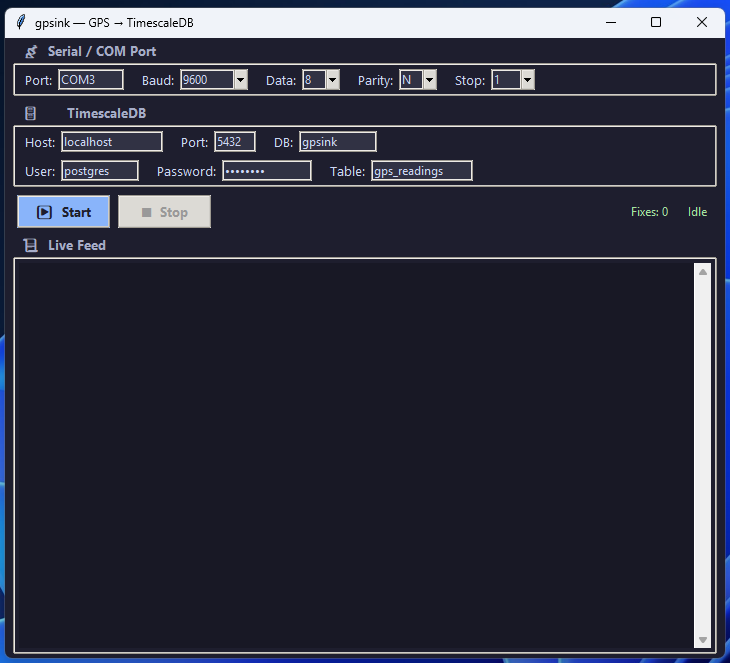

# 📡 gpsink

Stream NMEA GPS data from a COM port radio dongle into [TimescaleDB](https://www.timescale.com/) with [PostGIS](https://postgis.net/).

Built for ≥1 Hz radio GPS data sources transmitting `$GPRMC` sentences.

## Features

- **Serial / COM port reader** — configurable baud rate, parity, stop bits, flow control
- **NMEA parser** — extracts lat/lon/speed/course from `$GPRMC` sentences via `pynmea2`
- **TimescaleDB writer** — auto-provisions a hypertable with a PostGIS `geometry(Point, 4326)` column
- **CLI** — fully configurable via command-line flags
- **GUI** — simple Tkinter interface for configuring and monitoring the stream

## Quick Start

```bash
# Install with uv
uv sync --extra dev

# Run the CLI
uv run gpsink run --port COM3 --baud 9600 --db-host localhost --db-name gpsink

# Launch the GUI
uv run gpsink gui

# Provision the database schema only
uv run gpsink provision --db-host localhost --db-name gpsink
```

## CLI Reference

```
gpsink run [OPTIONS]      Start reading NMEA data and writing to TimescaleDB
gpsink gui                Launch the graphical interface
gpsink provision          Create extensions, table, and hypertable
```

### `gpsink run` Options

| Flag           | Default     | Description              |
|----------------|-------------|--------------------------|
| `--port / -p`  | `COM3`      | Serial / COM port name   |
| `--baud / -b`  | `9600`      | Baud rate                |
| `--bytesize`   | `8`         | Data bits (5-8)          |
| `--parity`     | `N`         | Parity (N/E/O/M/S)       |
| `--stopbits`   | `1`         | Stop bits (1/1.5/2)      |
| `--db-host`    | `localhost` | TimescaleDB host         |
| `--db-port`    | `5432`      | TimescaleDB port         |
| `--db-name`    | `gpsink`    | Database name            |
| `--db-user`    | `postgres`  | Database user            |
| `--db-password`| `postgres`  | Database password        |
| `--table`      | `gps_readings` | Target table name     |
| `-v`           | off         | Enable debug logging     |

## GUI Reference



## Database Schema

```sql
CREATE TABLE gps_readings (
    time         TIMESTAMPTZ      NOT NULL,
    geom         GEOMETRY(Point, 4326),
    latitude     DOUBLE PRECISION NOT NULL,
    longitude    DOUBLE PRECISION NOT NULL,
    speed_knots  DOUBLE PRECISION,
    course       DOUBLE PRECISION,
    status       CHAR(1),
    raw_sentence TEXT
);
-- Automatically converted to a TimescaleDB hypertable
```

## Development

```bash
# Install dev dependencies
uv sync --extra dev

# Run tests
uv run pytest

# Run with coverage
uv run pytest --cov=gpsink --cov-report=term-missing
```

## Project Structure

```
├── src/gpsink/
│   ├── __init__.py        # Package version
│   ├── config.py          # Dataclass configs for serial & DB
│   ├── nmea_parser.py     # GPRMC sentence parser → GPSFix
│   ├── serial_reader.py   # Threaded COM port reader
│   ├── db.py              # TimescaleDB/PostGIS writer
│   ├── cli.py             # Click CLI (run / gui / provision)
│   └── gui.py             # Tkinter GUI
├── tests/
│   ├── conftest.py        # Shared fixtures & sample sentences
│   ├── test_config.py
│   ├── test_nmea_parser.py
│   ├── test_serial_reader.py
│   ├── test_db.py
│   ├── test_cli.py
│   └── test_gui.py
└── pyproject.toml         # PEP 621 project config (uv/hatchling)
```

## License

MIT
